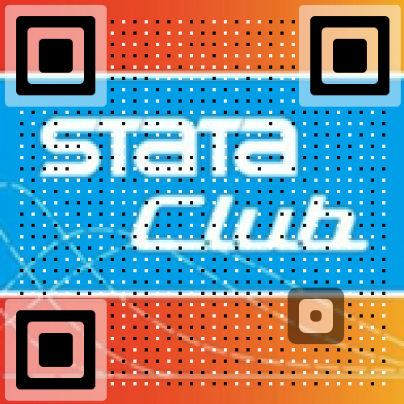

## 爬虫俱乐部资源共享中心

爬虫俱乐部资源共享中心旨在向有志于(有需求)学习Stata的学习者们提供 **免费的** 、 **便捷的** Stata学习资源，它们中一部分来自于爬虫俱乐部的成员们共享的do文档以及dta数据集，一部分搜集自网络上的免费资源。我们提供两种下载使用方式(都非常地便捷)，同时，我们欢迎大家在 [本仓库](https://github.com/Stata-Club/data) 下向我们提出你的建议，我们会以最快速度更新您所需要的资源。

如果您想访问 [爬虫俱乐部命令发布中心](https://stata-club.github.io/Sharing-Center-of-Stata-Club/program/) 这里是传送门

### 两种下载方式

1. 在下方的资源列表中直接点击后方的 `下载` 超链接即可下载。如  
    auto.dta [下载](https://github.com/Stata-Club/Sharing-Center-of-Stata-Club/blob/master/article/auto.dta?raw=true)
2. 在stata中使用copy命令直接拿取do文档以及ado文档，use命令直接拿取dta文档。如
    `use "https://github.com/Stata-Club/Sharing-Center-of-Stata-Club/blob/master/article/auto.dta?raw=true",clear`
    我们会在相关的推文中提及当期所用do文档及数据集的路径

### 没有所需的资源？

欢迎大家在 [本仓库](https://github.com/Stata-Club/data) 下或者发送邮件至 `statatraining@163.com` 提出您的建议或所需要的资源，我们会以最快速度更新您所需要的资源。

### 联系我们

欢迎关注爬虫俱乐部微信公众平台

欢迎访问[爬虫俱乐部官方网站](https://stata-club.github.io)

## 资源列表

### 推文所用资源

- temp.dta [下载](https://github.com/Stata-Club/Sharing-Center-of-Stata-Club/blob/master/article/temp.dta?raw=true)
- hangman [下载do文档](https://github.com/Stata-Club/Sharing-Center-of-Stata-Club/blob/master/article/hangman/hangman.do?raw=true) [下载数据集](https://github.com/Stata-Club/Sharing-Center-of-Stata-Club/blob/master/article/hangman/hangman_data.dta?raw=true)
- blackjack [下载](https://github.com/Stata-Club/Sharing-Center-of-Stata-Club/blob/master/article/blackjack.ado?raw=true)
- 财务数据批量下载程序 [下载](https://github.com/Stata-Club/Sharing-Center-of-Stata-Club/blob/master/article/Download_notice.do?raw=true)
- 上市公司公告批量下载程序 [下载](https://github.com/Stata-Club/Sharing-Center-of-Stata-Club/blob/master/article/Download_chinafin data.do?raw=true)
- C刊目录源数据 [下载](https://github.com/Stata-Club/Sharing-Center-of-Stata-Club/blob/master/article/C刊目录源数据.txt?raw=true)
- 211大学目录 [下载](https://github.com/Stata-Club/Sharing-Center-of-Stata-Club/blob/master/article/211大学目录.txt?raw=true)

### Stata十八讲-人大陈传波

- 1.dta [下载](https://github.com/Stata-Club/Sharing-Center-of-Stata-Club/blob/master/18lessons/1.dta?raw=true)
- 1.gph [下载](https://github.com/Stata-Club/Sharing-Center-of-Stata-Club/blob/master/18lessons/1.gph?raw=true)
- 157模拟正态白噪声.dta [下载](https://github.com/Stata-Club/Sharing-Center-of-Stata-Club/blob/master/18lessons/157模拟正态白噪声.dta?raw=true)
- 157页模拟正态白噪声.do [下载](https://github.com/Stata-Club/Sharing-Center-of-Stata-Club/blob/master/18lessons/157页模拟正态白噪声.do?raw=true)
- 165序列相关性检验phillips.do [下载](https://github.com/Stata-Club/Sharing-Center-of-Stata-Club/blob/master/18lessons/165序列相关性检验phillips.do?raw=true)
- 166prminwge.do [下载](https://github.com/Stata-Club/Sharing-Center-of-Stata-Club/blob/master/18lessons/166prminwge.do?raw=true)
- 166单位根检验.do [下载](https://github.com/Stata-Club/Sharing-Center-of-Stata-Club/blob/master/18lessons/166单位根检验.do?raw=true)
- 167协整检验.do [下载](https://github.com/Stata-Club/Sharing-Center-of-Stata-Club/blob/master/18lessons/167协整检验.do?raw=true)
- 167单位根检验nyse.do [下载](https://github.com/Stata-Club/Sharing-Center-of-Stata-Club/blob/master/18lessons/167单位根检验nyse.do?raw=true)
- 167单位根检验nyse2.do [下载](https://github.com/Stata-Club/Sharing-Center-of-Stata-Club/blob/master/18lessons/167单位根检验nyse2.do?raw=true)
- 168伪回归问题模拟.do [下载](https://github.com/Stata-Club/Sharing-Center-of-Stata-Club/blob/master/18lessons/168伪回归问题模拟.do?raw=true)
- 170经典假设满足时ols 估计量的小样本性质.do [下载](https://github.com/Stata-Club/Sharing-Center-of-Stata-Club/blob/master/18lessons/170经典假设满足时ols 估计量的小样本性质.do?raw=true)
- 174-175第二三四假设不成立时.do [下载](https://github.com/Stata-Club/Sharing-Center-of-Stata-Club/blob/master/18lessons/174-175第二三四假设不成立时.do?raw=true)
- 176简单回归分析.do [下载](https://github.com/Stata-Club/Sharing-Center-of-Stata-Club/blob/master/18lessons/176简单回归分析.do?raw=true)
- 178多元回归分析.do [下载](https://github.com/Stata-Club/Sharing-Center-of-Stata-Club/blob/master/18lessons/178多元回归分析.do?raw=true)
- 180非线性回归分析.do [下载](https://github.com/Stata-Club/Sharing-Center-of-Stata-Club/blob/master/18lessons/180非线性回归分析.do?raw=true)
- 181回归模型的有效性.do [下载](https://github.com/Stata-Club/Sharing-Center-of-Stata-Club/blob/master/18lessons/181回归模型的有效性.do?raw=true)
- 2.gph [下载](https://github.com/Stata-Club/Sharing-Center-of-Stata-Club/blob/master/18lessons/2.gph?raw=true)
- 3.gph [下载](https://github.com/Stata-Club/Sharing-Center-of-Stata-Club/blob/master/18lessons/3.gph?raw=true)
- 3origin.dta [下载](https://github.com/Stata-Club/Sharing-Center-of-Stata-Club/blob/master/18lessons/3origin.dta?raw=true)
- 4.gph [下载](https://github.com/Stata-Club/Sharing-Center-of-Stata-Club/blob/master/18lessons/4.gph?raw=true)
- 521.dta [下载](https://github.com/Stata-Club/Sharing-Center-of-Stata-Club/blob/master/18lessons/521.dta?raw=true)
- auto.dta [下载](https://github.com/Stata-Club/Sharing-Center-of-Stata-Club/blob/master/18lessons/auto.dta?raw=true)
- barium.dta [下载](https://github.com/Stata-Club/Sharing-Center-of-Stata-Club/blob/master/18lessons/barium.dta?raw=true)
- caschool.dta [下载](https://github.com/Stata-Club/Sharing-Center-of-Stata-Club/blob/master/18lessons/caschool.dta?raw=true)
- census10.dta [下载](https://github.com/Stata-Club/Sharing-Center-of-Stata-Club/blob/master/18lessons/census10.dta?raw=true)
- ch7.log [下载](https://github.com/Stata-Club/Sharing-Center-of-Stata-Club/blob/master/18lessons/ch7.log?raw=true)
- destring1.dta [下载](https://github.com/Stata-Club/Sharing-Center-of-Stata-Club/blob/master/18lessons/destring1.dta?raw=true)
- economy.dta [下载](https://github.com/Stata-Club/Sharing-Center-of-Stata-Club/blob/master/18lessons/economy.dta?raw=true)
- female.dta [下载](https://github.com/Stata-Club/Sharing-Center-of-Stata-Club/blob/master/18lessons/female.dta?raw=true)
- male.dta [下载](https://github.com/Stata-Club/Sharing-Center-of-Stata-Club/blob/master/18lessons/male.dta?raw=true)
- math.dta [下载](https://github.com/Stata-Club/Sharing-Center-of-Stata-Club/blob/master/18lessons/math.dta?raw=true)
- mcas.dta [下载](https://github.com/Stata-Club/Sharing-Center-of-Stata-Club/blob/master/18lessons/mcas.dta?raw=true)
- mydata.dta [下载](https://github.com/Stata-Club/Sharing-Center-of-Stata-Club/blob/master/18lessons/mydata.dta?raw=true)
- mydata1.dta [下载](https://github.com/Stata-Club/Sharing-Center-of-Stata-Club/blob/master/18lessons/mydata1.dta?raw=true)
- mydata2.dta [下载](https://github.com/Stata-Club/Sharing-Center-of-Stata-Club/blob/master/18lessons/mydata2.dta?raw=true)
- mydo.do [下载](https://github.com/Stata-Club/Sharing-Center-of-Stata-Club/blob/master/18lessons/mydo.do?raw=true)
- myfile.smcl [下载](https://github.com/Stata-Club/Sharing-Center-of-Stata-Club/blob/master/18lessons/myfile.smcl?raw=true)
- mylong.dta [下载](https://github.com/Stata-Club/Sharing-Center-of-Stata-Club/blob/master/18lessons/mylong.dta?raw=true)
- mywide.dta [下载](https://github.com/Stata-Club/Sharing-Center-of-Stata-Club/blob/master/18lessons/mywide.dta?raw=true)
- mywide2.dta [下载](https://github.com/Stata-Club/Sharing-Center-of-Stata-Club/blob/master/18lessons/mywide2.dta?raw=true)
- nlswork.dta [下载](https://github.com/Stata-Club/Sharing-Center-of-Stata-Club/blob/master/18lessons/nlswork.dta?raw=true)
- nyse.dta [下载](https://github.com/Stata-Club/Sharing-Center-of-Stata-Club/blob/master/18lessons/nyse.dta?raw=true)
- phillips.dta [下载](https://github.com/Stata-Club/Sharing-Center-of-Stata-Club/blob/master/18lessons/phillips.dta?raw=true)
- prminwge.dta [下载](https://github.com/Stata-Club/Sharing-Center-of-Stata-Club/blob/master/18lessons/prminwge.dta?raw=true)
- profile.do [下载](https://github.com/Stata-Club/Sharing-Center-of-Stata-Club/blob/master/18lessons/profile.do?raw=true)
- scoresize.log [下载](https://github.com/Stata-Club/Sharing-Center-of-Stata-Club/blob/master/18lessons/scoresize.log?raw=true)
- star_sw.dta [下载](https://github.com/Stata-Club/Sharing-Center-of-Stata-Club/blob/master/18lessons/star_sw.dta?raw=true)
- student.dta [下载](https://github.com/Stata-Club/Sharing-Center-of-Stata-Club/blob/master/18lessons/student.dta?raw=true)
- white.dta [下载](https://github.com/Stata-Club/Sharing-Center-of-Stata-Club/blob/master/18lessons/white.dta?raw=true)
- whitetest.dta [下载](https://github.com/Stata-Club/Sharing-Center-of-Stata-Club/blob/master/18lessons/whitetest.dta?raw=true)
- 十八章综合案例1.do [下载](https://github.com/Stata-Club/Sharing-Center-of-Stata-Club/blob/master/18lessons/十八章综合案例1.do?raw=true)
- 十八章综合案例2.do [下载](https://github.com/Stata-Club/Sharing-Center-of-Stata-Club/blob/master/18lessons/十八章综合案例2.do?raw=true)
- 十八章综合案例3.do [下载](https://github.com/Stata-Club/Sharing-Center-of-Stata-Club/blob/master/18lessons/十八章综合案例3.do?raw=true)

### 高级计量经济学及stata应用-陈强

- auto.dta [下载](https://github.com/Stata-Club/Sharing-Center-of-Stata-Club/blob/master/chenqiang/auto.dta?raw=true)
- brand.dta [下载](https://github.com/Stata-Club/Sharing-Center-of-Stata-Club/blob/master/chenqiang/brand.dta?raw=true)
- consumption_china.dta [下载](https://github.com/Stata-Club/Sharing-Center-of-Stata-Club/blob/master/chenqiang/consumption_china.dta?raw=true)
- crime1.dta [下载](https://github.com/Stata-Club/Sharing-Center-of-Stata-Club/blob/master/chenqiang/crime1.dta?raw=true)
- dow1.dta [下载](https://github.com/Stata-Club/Sharing-Center-of-Stata-Club/blob/master/chenqiang/dow1.dta?raw=true)
- grilic.dta [下载](https://github.com/Stata-Club/Sharing-Center-of-Stata-Club/blob/master/chenqiang/grilic.dta?raw=true)
- grunfeld.dta [下载](https://github.com/Stata-Club/Sharing-Center-of-Stata-Club/blob/master/chenqiang/grunfeld.dta?raw=true)
- hmda_short.dta [下载](https://github.com/Stata-Club/Sharing-Center-of-Stata-Club/blob/master/chenqiang/hmda_short.dta?raw=true)
- hprice2a.dta [下载](https://github.com/Stata-Club/Sharing-Center-of-Stata-Club/blob/master/chenqiang/hprice2a.dta?raw=true)
- hsb2.dta [下载](https://github.com/Stata-Club/Sharing-Center-of-Stata-Club/blob/master/chenqiang/hsb2.dta?raw=true)
- icecream.dta [下载](https://github.com/Stata-Club/Sharing-Center-of-Stata-Club/blob/master/chenqiang/icecream.dta?raw=true)
- klein.dta [下载](https://github.com/Stata-Club/Sharing-Center-of-Stata-Club/blob/master/chenqiang/klein.dta?raw=true)
- laborsub.dta [下载](https://github.com/Stata-Club/Sharing-Center-of-Stata-Club/blob/master/chenqiang/laborsub.dta?raw=true)
- lutkepohl2.dta [下载](https://github.com/Stata-Club/Sharing-Center-of-Stata-Club/blob/master/chenqiang/lutkepohl2.dta?raw=true)
- macro_swatson.dta [下载](https://github.com/Stata-Club/Sharing-Center-of-Stata-Club/blob/master/chenqiang/macro_swatson.dta?raw=true)
- mpyr.dta [下载](https://github.com/Stata-Club/Sharing-Center-of-Stata-Club/blob/master/chenqiang/mpyr.dta?raw=true)
- mus08cigar.dta [下载](https://github.com/Stata-Club/Sharing-Center-of-Stata-Club/blob/master/chenqiang/mus08cigar.dta?raw=true)
- mus08psidextract.dta [下载](https://github.com/Stata-Club/Sharing-Center-of-Stata-Club/blob/master/chenqiang/mus08psidextract.dta?raw=true)
- mus18data1.dta [下载](https://github.com/Stata-Club/Sharing-Center-of-Stata-Club/blob/master/chenqiang/mus18data1.dta?raw=true)
- nerlove-1963-original.pdf [下载](https://github.com/Stata-Club/Sharing-Center-of-Stata-Club/blob/master/chenqiang/nerlove-1963-original.pdf?raw=true)
- nerlove.dta [下载](https://github.com/Stata-Club/Sharing-Center-of-Stata-Club/blob/master/chenqiang/nerlove.dta?raw=true)
- nerlove.xls [下载](https://github.com/Stata-Club/Sharing-Center-of-Stata-Club/blob/master/chenqiang/nerlove.xls?raw=true)
- panel84extract.dta [下载](https://github.com/Stata-Club/Sharing-Center-of-Stata-Club/blob/master/chenqiang/panel84extract.dta?raw=true)
- pe.dta [下载](https://github.com/Stata-Club/Sharing-Center-of-Stata-Club/blob/master/chenqiang/pe.dta?raw=true)
- poissonreg.dta [下载](https://github.com/Stata-Club/Sharing-Center-of-Stata-Club/blob/master/chenqiang/poissonreg.dta?raw=true)
- sp500.dta [下载](https://github.com/Stata-Club/Sharing-Center-of-Stata-Club/blob/master/chenqiang/sp500.dta?raw=true)
- supdem.dta [下载](https://github.com/Stata-Club/Sharing-Center-of-Stata-Club/blob/master/chenqiang/supdem.dta?raw=true)
- tobacco.dta [下载](https://github.com/Stata-Club/Sharing-Center-of-Stata-Club/blob/master/chenqiang/tobacco.dta?raw=true)
- traffic.dta [下载](https://github.com/Stata-Club/Sharing-Center-of-Stata-Club/blob/master/chenqiang/traffic.dta?raw=true)
- ukrates.dta [下载](https://github.com/Stata-Club/Sharing-Center-of-Stata-Club/blob/master/chenqiang/ukrates.dta?raw=true)
- womenwk.dta [下载](https://github.com/Stata-Club/Sharing-Center-of-Stata-Club/blob/master/chenqiang/womenwk.dta?raw=true)
